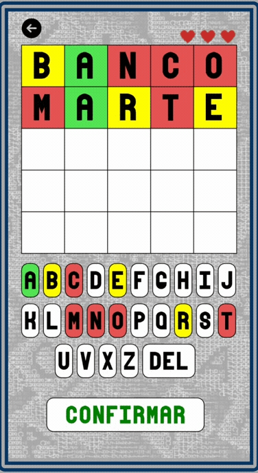

# letrox_version_wordle

> Jogo desenvolvido para praticar conceitos de programação orientada a objetos com javascript

**Tecnologias Ultilizadas**: 
- 
- 

## 🕹️ Descrição do jogo

    

gameplay do jogo Letrox

**Bem-vindo ao Letrox!**

O Letrox é uma versão única e divertida do clássico jogo de palavras Wordle. Neste jogo, você terá a oportunidade de testar suas habilidades de dedução e conhecimento de vocabulário de uma forma desafiadora e envolvente.O objetivo do Letrox é adivinhar uma palavra secreta de cinco letras em um número limitado de tentativas. A cada tentativa, o jogo fornecerá feedback indicando quais letras estão corretas e em suas posições corretas, quais letras estão corretas, mas em posições erradas, e quais letras não estão na palavra secreta.

## 🎯 Objetivo

O principal objetivo de criar o jogo Letrox foi aprimorar e aplicar os conceitos de Programação Orientada a Objetos (POO) em JavaScript. Desenvolver o Letrox proporcionou uma oportunidade prática de explorar e consolidar os princípios fundamentais da **POO**, como **encapsulamento**, **herança** e **polimorfismo**, em um projeto real.Além disso, o Letrox também foi uma forma divertida de praticar a **lógica de programação** e a manipulação de strings em JavaScript, bem como de melhorar minhas habilidades de design e implementação de jogos. Espero que o **Letrox** não apenas proporcione diversão e desafio aos jogadores, mas também inspire outros desenvolvedores a explorar e experimentar com os conceitos de POO em seus próprios projetos.

## 🤔 Como jogar?

O Letrox é um jogo simples e divertido que desafia você a adivinhar uma palavra secreta de cinco letras em um número limitado de tentativas. Aqui está um guia passo a passo de como jogar:

- 🎲 **Palavra Secreta**: O jogo escolhe aleatoriamente uma palavra de cinco letras como a palavra secreta.

- ⏳ **Tentativas**: Você tem um número limitado de tentativas para adivinhar a palavra secreta. O número de tentativas restantes é exibido na parte superior da tela.

- 🤔 **Adivinhação**: Digite uma palavra de cinco letras como sua tentativa de adivinhar a palavra secreta. O jogo fornecerá feedback após cada tentativa, indicando quais letras estão corretas e em suas posições corretas, quais letras estão corretas, mas em posições erradas, e quais letras não estão na palavra secreta.

- 👀 **Feedback**:  Com base no feedback fornecido pelo jogo, faça novas tentativas, ajustando sua palavra de acordo com as informações recebidas.

- 🏆 **Vitória ou Derrota**: Você vence o jogo se adivinhar a palavra secreta dentro do número de tentativas permitido. Se não conseguir adivinhar a palavra dentro do limite de tentativas, você perde o jogo.

- 🔁 **Reiniciar**: Se quiser jogar novamente, basta clicar no botão de reinício para iniciar um novo jogo com uma palavra secreta diferente.

## 🎮 Vamos Jogar?

Acesse este [link](https://carlosg18.github.io/letrox_p5js/) para poder jogar o meu jogo! espero que goste da jogatina! divirta-se 👋! 

## 🗣️ Deixe seu feedback

Quer deixar um feedback sobre o meu jogo? me mande uma mensagem:

📧 email: desenvolvimentodev55@gmail.com
